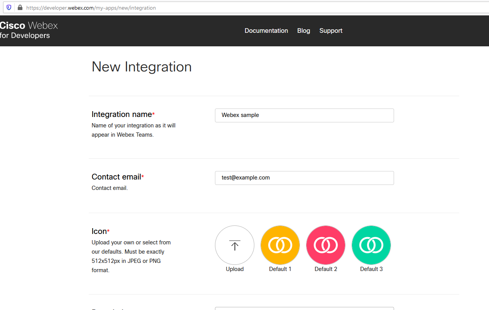
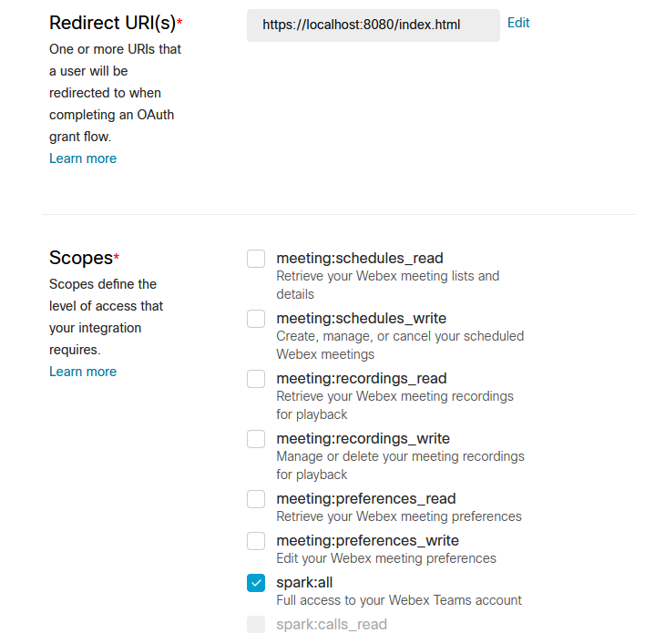
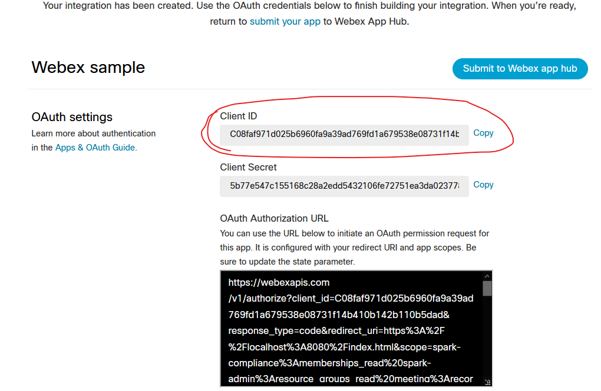
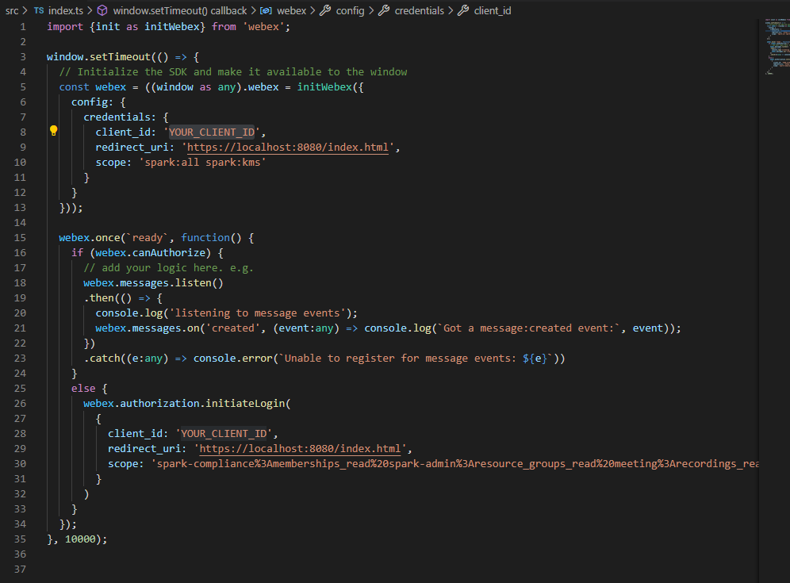
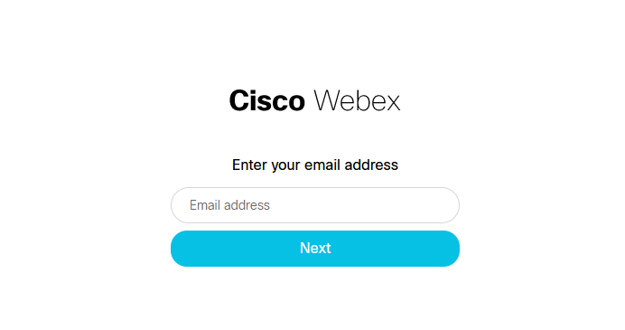
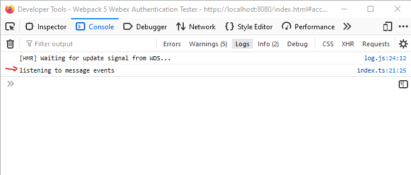
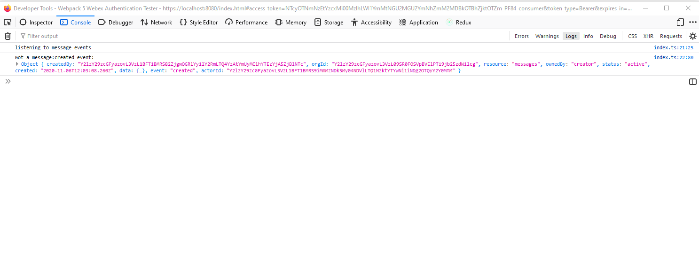

# Webpack 5 and Typescript - Webex sample
This project is a sample that shows how to use the Webex SDK with a Webpack 5 project with Typescript.

## How to get started

### Create Webex Application
* Login to https://developer.webex.com
* Create a New App
* Choose Integration

* Fill in the needed fields
* Add redirect URI(s) https://localhost:8080/index.html
* Choose the spark:all scope

* Create integration
* Copy the Client ID 

### Change Client ID
* Replace 'YOUR_CLIENT_ID' with the copied Client ID into the src/index.ts file

### Install dependencides
* install the dependencies with `npm install` or `yarn`

### Run 
* type `npm run start` or `yarn start`
* open a browser `https://localhost:8080`
> You may have to ignore the certificate warning
* After 10 seconds you will be redirected to the Webex login page
> The first time you have to accept the access to your created application
* Login with your Teams user

* You will be redirected back to https://localhost:8080
* Open the Developer Tools of the browser (F12 or Ctrl+Shift+J (on Windows) or Ctrl+Option+J (on Mac))
* Check the console
> The message "listening to message events" will appear

* Send / receive a message over Webex Teams with the logged in user 
* The message will appear in the console

## Do more
Now you are able to go ahead and adjust the code in the index.ts to do whatever you want to do.
